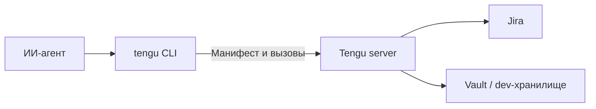

# Tengu

**Корпоративные инструменты для ИИ-агентов через один CLI.**

Tengu позволяет агенту узнать доступные команды и работать с Jira через `tengu`.
Интеграции исполняются на центральном сервере, где хранятся пользовательские PAT.
Для обычных вызовов агенту нужен доступ к хабу, без передачи ему Jira PAT.

[Установка](docs/installation.md) · [Быстрый старт](#быстрый-старт) · [Архитектура](ARCHITECTURE.md) · [Планы](specs/WORK_ITEMS.md) · [Участие](CONTRIBUTING.md)

**Статус: MVP 0.1.0.** Доступны Jira через REST API v2 с PAT и диагностика хаба.
CLI работает на Linux x64, Windows x64 и macOS Apple Silicon; сервер требует JDK 21+
или Docker. API и команды могут меняться до стабилизации версии 1.0.

## Зачем Tengu

- **Один вход для агента.** `tengu` показывает инструменты, а `--help` объясняет команды и флаги.
- **Доступы на сервере.** Плагин получает секреты только своего пользователя и инструмента; поддерживаются Vault и локальный режим разработки.
- **Вывод для автоматизации.** Компактные таблицы, подсказки следующего шага и явные коды завершения.
- **Тонкий клиент.** Нативный CLI работает без JVM и узнаёт команды из серверного манифеста.



Интерфейс следует [AXI (Agent eXperience Interface)](.agents/skills/axi/SKILL.md),
стандарту командных инструментов для агентов. Структурированный вывод использует
[TOON (Token-Oriented Object Notation)](https://toonformat.dev), компактное текстовое
представление объектов и таблиц. Успех возвращает exit 0, ошибка использования - 2,
ошибка выполнения - 1; структурированный вывод CLI идёт в stdout.

## Как выглядит для агента

Пример с подключённой Jira и демонстрационными задачами:

```text
$ tengu
bin: tengu
description: Agent tool hub: discover and invoke corporate tools
tools[2]{name,summary}:
  status,Hub health and diagnostics
  jira,"Jira issues: list, view, create, comment"
help[2]:
  Run `tengu tools show <tool>` for what a tool can do
  Run `tengu <tool> <command> --help` for command usage

$ tengu jira issues list --project FOO --limit 2
count: 2 of 213 total
issues[2]{key,title,state}:
  FOO-1,Fix auth bug,Open
  FOO-2,Add pagination,Open
help[1]: Run `tengu jira issues list --project FOO --start-at 2` for the next page
```

Jira-плагин умеет перечислять проекты, искать и просматривать задачи и комментарии,
создавать задачи и добавлять комментарии. [Полный список команд](plugins/jira/README.md).

## Быстрый старт

Первый запуск ниже проверяет CLI и сервер без Jira и внешних учётных данных.
Нужны Git и JDK 21+. Для сборки CLI на macOS нужен полный Xcode.
Готовые бинарники и установка из исходников описаны в [инструкции установки](docs/installation.md).
Для PowerShell и cmd есть [отдельный quickstart](docs/windows.md).

### 1. Получить исходники и запустить сервер

Linux / macOS, терминал 1:

```sh
git clone https://github.com/finnetrolle/tengu.git
cd tengu
java -version

TENGU_HUB_TOKENS="dev=tengu-local" \
TENGU_DEV_SECRETS=1 \
./gradlew :server:run
```

`tengu-local` - демонстрационный hub token для локального запуска. Он отличается
от Jira PAT. Сервер слушает порт 8080; для общего стенда нужны собственные токены
и ограничение сетевого доступа. Первая сборка скачивает Gradle и зависимости.

### 2. Собрать и установить CLI

В терминале 2 перейди в клонированный каталог `tengu` и выполни команду для своей ОС:

| Платформа | Команда | Результат |
|---|---|---|
| Linux x64 | `./gradlew :cli:linkReleaseExecutableLinuxX64` | `cli/build/bin/linuxX64/releaseExecutable/tengu.kexe` |
| macOS Apple Silicon | `./gradlew :cli:linkReleaseExecutableMacosArm64` | `cli/build/bin/macosArm64/releaseExecutable/tengu.kexe` |
| Windows x64 | `.\gradlew.bat :cli:linkReleaseExecutableMingwX64` | `cli\build\bin\mingwX64\releaseExecutable\tengu.exe` |

На Linux установи бинарник в пользовательский каталог:

```sh
mkdir -p "$HOME/.local/bin"
install -m 0755 cli/build/bin/linuxX64/releaseExecutable/tengu.kexe "$HOME/.local/bin/tengu"
export PATH="$HOME/.local/bin:$PATH"
```

На macOS замени `linuxX64` на `macosArm64`. Добавь каталог в PATH своей оболочки,
если хочешь использовать `tengu` в новых терминалах. Для уже установленного CLI этот шаг не нужен.

### 3. Проверить первый вызов

```sh
curl -fsS http://127.0.0.1:8080/v1/health
tengu setup --url http://127.0.0.1:8080 --token tengu-local
tengu
tengu status
```

В каталоге появится инструмент `status`; его вызов покажет версию и uptime сервера.
`setup` сохраняет конфигурацию после успешного подключения: `~/.config/tengu`
на Linux/macOS или `%APPDATA%\tengu` на Windows. Остановить сервер можно через Ctrl+C.

### 4. Подключить Jira

Перезапусти сервер, добавив URL своей Jira:

```sh
TENGU_HUB_TOKENS="dev=tengu-local" \
TENGU_DEV_SECRETS=1 \
TENGU_JIRA_BASE_URL="https://jira.example.com" \
./gradlew :server:run
```

Введи PAT самостоятельно в обычном терминале. Следующий блок рассчитан на Bash;
из другой оболочки сначала запусти `bash`:

```bash
printf 'Jira PAT: '
IFS= read -r -s TENGU_JIRA_PAT
printf '\n'
printf '%s' "$TENGU_JIRA_PAT" | tengu jira auth login --token -
unset TENGU_JIRA_PAT

tengu jira projects list
tengu jira issues list --project FOO --limit 5
```

Замени `FOO` ключом проекта из списка. PAT проверяется через Jira и сохраняется на
сервере. В режиме `TENGU_DEV_SECRETS=1` хранилище незашифровано: `data/{user}/{tool}.json`.
Для одноразового запуска с PAT в памяти используй [локальный Docker-профиль](docs/local-docker.md).

## Ограничения MVP

- Авторизация хаба использует статичные bearer-токены; SSO/OIDC пока нет.
- Создание задач и комментариев выполняется сразу. Подтверждение внешних изменений находится в [планах](specs/WORK_ITEMS.md).
- CLI-таргеты для Intel Mac и Linux ARM пока не объявлены.
- `docker-compose.yml` запускает **тестовый стенд с dev-Vault**. Для production нужны отдельно настроенный Vault KV v2, HTTPS и управление доступом; см. [документацию сервера](server/README.md).

## Документация и разработка

| Раздел | Содержание |
|---|---|
| [Установка](docs/installation.md) | Архивы релиза, проверка SHA256, сборка CLI и запуск серверного дистрибутива |
| [Windows](docs/windows.md) | Запуск сервера и CLI, ввод Jira PAT в PowerShell |
| [Локальный Docker](docs/local-docker.md) | Один контейнер, PAT в tmpfs |
| [Архитектура](ARCHITECTURE.md) | Модули, протокол, границы плагинов и секретов |
| [SDK плагинов](toolkit/README.md) | Контракт нового инструмента |
| [CLI](cli/README.md) / [сервер](server/README.md) | Поведение, конфигурация и устройство модулей |
| [Участие](CONTRIBUTING.md) | Задачи, локальные проверки и pull requests |
| [Безопасность](SECURITY.md) | Приватное сообщение об уязвимости и границы защиты |
| [Реестр задач](specs/WORK_ITEMS.md) | Текущие планы и статусы реализации |
| [Ручной выпуск](docs/releasing.md) | Подготовка архивов и публикация версии |

Основная локальная проверка: `./gradlew check`. Сборка всех модулей: `./gradlew build`.
Подробнее о тестах и E2E - в [CONTRIBUTING.md](CONTRIBUTING.md).

## Лицензия

[MIT](LICENSE), Copyright (c) 2026 Maksim Syachin.
