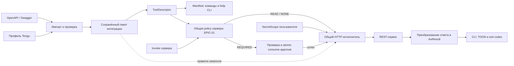

# EPIC-02: Подключение инструментов Tengu по OpenAPI

- **ID:** `EPIC-02`
- **Тип:** Epic
- **Статус:** Draft
- **Прогресс:** не декомпозирован
- **Оценка:** после уточнения пилота

## Результат и основные тезисы

Подключать REST-сервисы к Tengu по OpenAPI/Swagger: предоставлять спецификацию,
адрес сервиса и профиль интеграции, получать каталог вызываемых команд.
Для новой операции в поддерживаемом подмножестве API достаточно обновить
спецификацию и настройки, без отдельного Kotlin-обработчика.

1. **Общий исполнитель на сервере.** Описание операции определяет HTTP-запрос;
   команды и help генерируются через существующий `ToolDescriptor`.
2. **Два уровня описания.** OpenAPI задаёт технический контракт; профиль Tengu
   уточняет имена команд, доступные операции, авторизацию и представление ответа.
3. **Автоматический импорт, явное включение.** Импорт составляет каталог
   кандидатов и отчёт об ограничениях. В manifest попадают выбранные операции
   с явно проверенной оператором классификацией `READ`, `WRITE` или `DELETE`.
4. **Полуавтоматическое улучшение.** LLM может предложить настройки и примеры
   при подготовке интеграции. Исполнение команд детерминировано и не требует LLM.
5. **Специализированные плагины сохраняют свою роль.** Составление JQL,
   разрешение имён в ID и многошаговые бизнес-операции могут требовать кода.
6. **Единая безопасность команд.** Сгенерированные команды используют metadata
   и серверное подтверждение из [EPIC-01](epic_01_safe_external_mutations.md).
   Импорт интеграции не является разрешением на выполнение её мутаций.

Это черновик направления. Точные форматы, оценки и дочерние issues определяются
при детализации; документ пока не является implementation-ready контрактом.

## Предлагаемая архитектура



- Предполагаемый модуль `:plugins:openapi` реализует существующий
  [ToolPlugin](../../toolkit/src/main/kotlin/ru/finnetrolle/tengu/toolkit/ToolPlugin.kt).
  Одна реализация обслуживает несколько именованных интеграций, каждая со своим
  descriptor и скоупом секретов.
- Импортёр разбирает спецификацию готовой JVM-библиотекой и строит внутреннюю
  модель операций. Из одной модели получаются descriptor и план HTTP-запроса,
  чтобы справка и исполнение не расходились. Результат сохраняется как пакет:
  публичные descriptors и внутренние правила запросов и вывода.
- Профиль хранит выбор операций, переименования, привязку параметров,
  правила вывода и пагинации, эффект команды и ссылки на секреты. Значений
  токенов в спецификации, профиле и manifest нет. Адрес назначения задаёт
  конфигурация интеграции; внешние ссылки схемы не должны менять его незаметно.
- Исполнитель связывает args/flags с path/query/body, добавляет авторизацию,
  выполняет запрос и переводит ответ в `AxiResult`. Его вызов всегда проходит
  через общую policy сервера до `ToolPlugin.invoke`; плагин не выпускает и не
  проверяет approvals. Компактные поля, усечение, пустые результаты и подсказки
  оформляются через `AxiPayloads`.
- CLI остаётся тонким клиентом без зависимости от OpenAPI-парсера и плагинов.
  Общую валидацию в `:protocol` расширяем только для поддержанных форм ввода.
- Импорт и обновление выполняются явно оператором сервера. При запуске сервер
  загружает готовый пакет и проверяет его целостность и policy; Swagger заново
  не преобразуется. Агент с обычным hub token не меняет пакет и профиль.
- В первой версии пакет и конфигурация назначения неизменны до остановки
  процесса. Новый пакет применяется через перезапуск с очисткой approvals;
  descriptor и планы запросов меняются вместе, `manifestVersion` увеличивается.
  Hot reload исключён: в TNG-01-03 manifest version не входит в digest, поэтому
  смена правил исполнения при сохранении старого approval недопустима.

## Настройки поверх спецификации

Пример содержания профиля, без фиксации синтаксиса:

| Настройка | Пример |
|---|---|
| Выбор и имя операции | операция получения Jira issue → `issues view` |
| Аргумент | `issueIdOrKey` → позиционный `key` |
| Поля результата | `key`, `fields.summary` → `title`, `fields.status.name` → `state` |
| Пагинация | массив `issues`, счётчик `total`, параметры `startAt` / `maxResults` |
| Авторизация | Bearer из пользовательского `SecretScope`, ключ `pat` |
| Эффект | явно заданный оператором `READ`, `WRITE` или `DELETE` |
| Подтверждение | `READ` → `NONE`; `WRITE` / `DELETE` → `REQUIRED` по EPIC-01 |

OpenAPI Overlay можно использовать для дополнений к исходной спецификации.
Семантику специфичных правил Tengu задаёт наш профиль. Переименование не должно
автоматически заменять существующую Jira-команду: коллизия требует явного решения.

## Манифест и подтверждение по EPIC-01

План предполагает поля `effect` и `confirmationPolicy` по требованиям
[EPIC-01](epic_01_safe_external_mutations.md). TNG-01-02 отменена 2026-09-15;
контракт и поставку этих полей нужно пересмотреть до детализации этапа A.
Новая [TNG-05](../issues/issue_05_agent_tool_discovery.md) исследует discovery
и не считается реализацией metadata. Предлагаемые command descriptors:

```json
[
  {"path": ["issues", "view"], "summary": "Получить задачу", "effect": "READ", "confirmationPolicy": "NONE"},
  {"path": ["issues", "create"], "summary": "Создать задачу", "effect": "WRITE", "confirmationPolicy": "REQUIRED"},
  {"path": ["issues", "delete"], "summary": "Удалить задачу", "effect": "DELETE", "confirmationPolicy": "REQUIRED"}
]
```

Аргументы, флаги и остальные поля здесь опущены. HTTP-привязки и ссылки на
секреты остаются во внутреннем пакете. `approvalId` относится к конкретному
вызову и не хранится в manifest или профиле; `--approval` является глобальным
флагом общего CLI, а не параметром внешнего API.

- Эффект не выводится автоматически из HTTP-метода, имени или текста Swagger.
  Например, POST поиска может быть `READ`. LLM может предложить классификацию,
  но включение операции требует явного решения оператора в профиле.
- Неуказанный эффект оставляет операцию вне manifest с причиной в отчёте.
  Неявные defaults `READ/NONE` не применяются к неизвестным импортированным
  операциям. Импортёр формирует policy по таблице выше;
  общий registry отклоняет `WRITE/NONE` и `DELETE/NONE`, включая загрузку пакета.
- Наличие metadata ещё не обеспечивает enforcement: до завершения
  [TNG-01-03](../issues/epic_01/issue_01_03_two_phase_approval.md) допускается
  публикация только проверенных `READ/NONE` операций.

Для `REQUIRED` используется существующий в плане EPIC-01 сценарий:

1. CLI вызывает `/v1/invoke/prepare`. Сервер валидирует данные и возвращает
   redacted preview с системой, объектом, эффектом, точными параметрами, ID и
   TTL 10 минут. Плагин и внешний API не вызываются; CLI завершается без prompt.
2. Человек того же пользователя подтверждает операцию через отдельный
   approve endpoint или human-owned CLI. Approver credential недоступен агенту
   и плагину; обычный hub token не позволяет подтвердить операцию.
3. Агент повторяет точную команду с `--approval`. Сервер сверяет digest
   `userId`, `tool`, `commandPath`, args и flags, атомарно переводит approval
   из `APPROVED` в `CONSUMED` и только затем вызывает общий HTTP-исполнитель.
   Весь пользовательский JSON-ввод входит в args/flags до вычисления digest.
4. Изменённый запрос, чужой, неподтверждённый, истёкший или использованный
   approval отклоняется до вызова плагина. После consume ошибка или потеря
   ответа не допускает автоматического retry мутации; требуется новое
   prepare и подтверждение. Чтение остаётся однофазным.

## Границы первой версии

- Явный импорт локального файла или указанного URL OpenAPI 3.0; Swagger 2.0
  допускается через нормализацию парсером. Другие версии требуют отдельной проверки.
- Поддерживаемое подмножество: скалярные path/query-параметры, явно описанные
  JSON-тела и JSON-ответы, Bearer/API key через серверные секреты.
- Модель JSON-ввода требует уточнения: текущий `FlagType` содержит только
  `STRING`, `INT`, `BOOL`. Сложные формы должны либо корректно проверяться на
  обеих сторонах, либо явно отклоняться при импорте.
- Пилот на Jira соответствующей редакции и версии, затем проверка повторного
  использования на втором REST-сервисе или независимой тестовой API-fixture.
- Отчёт импорта показывает включённые, исключённые и неподдержанные операции
  с причинами. Ошибки имён и схем не исправляются молча.
- Сценарии записи и удаления используют описанный выше контракт EPIC-01;
  собственных approval endpoints, токенов или логики подтверждения в плагине нет.

## Предлагаемые этапы

Каждый этап даёт проверяемый результат; это кандидаты для последующей нарезки,
а не уже опубликованные дочерние issues. Оценки пока не зафиксированы.

| Этап | Наблюдаемый результат | Жёсткие зависимости |
|---|---|---|
| A. Первая команда чтения | Импорт операции получения объекта; `READ/NONE` видны в help и manifest, CLI возвращает компактный результат | Пересмотр и поставка контракта metadata EPIC-01 |
| B. Списки и JSON-ввод | Поиск, включая POST с JSON-телом, показывает выбранные поля, total, пустой результат и следующую страницу | A |
| C. Второй сервис и обновление | Другой API и новая операция подключаются сохранённым пакетом без нового обработчика; после перезапуска CLI обновляет manifest | A |
| D. Управляемые запись и удаление | Создание объекта с JSON-телом и удаление с пустым успешным ответом проходят общий prepare/approve/invoke | B, C, TNG-01-03 |

Начальный этап для детализации: A, его поставка зависит от контракта metadata,
поставка которого пока не определена после отмены TNG-01-02.
B и C не блокируют друг друга. Чтение не требует enforcement TNG-01-03;
его завершение обязательно для D, включая проверку инвалидирования approvals
при применении нового пакета по правилам этапа C.

## Критерии завершения

- [ ] Два разных API подключены общей реализацией плагина.
- [ ] Поддерживаемая новая операция появляется без изменения Kotlin-кода.
- [ ] Help, обязательные параметры и фактический HTTP-запрос согласованы;
  неизвестный или некорректный ввод отклоняется до обращения к сервису.
- [ ] Проверены detail, список с пагинацией, JSON-ввод и понятные AXI-ошибки;
  секреты не появляются в выводе.
- [ ] Manifest и help содержат явные effect/policy каждой команды; неизвестный
  эффект не становится `READ`, `WRITE/NONE` и `DELETE/NONE` отклоняются.
- [ ] Для записи и удаления prepare не вызывает плагин; approved exact invoke
  вызывает его один раз. Подмена JSON-ввода, replay, expiry и чужой approval
  отклоняются; hub token не может approve, retry после consume отсутствует.
- [ ] Обновление описания согласованно меняет manifest и исполнение;
  после перезапуска загружается готовый пакет без преобразования Swagger,
  старые approvals непригодны. Неподдержанные операции и конфликты имён видны.
- [ ] Сквозные проверки CLI → сервер → независимая HTTP-fixture подтверждают
  запросы и ответы; существующие Jira-команды продолжают работать.

## Не входит и открытые решения

Не входят: полная поддержка всех конструкций OpenAPI, multipart и файлы,
streaming, OAuth browser flow, обход произвольного сайта для поиска API,
восстановление схемы из трафика, MCP/GraphQL/gRPC-адаптеры, workflow engine,
автоматическое переписывание существующего Jira-плагина и LLM в пути исполнения.

При детализации выбрать: версию Jira и второй API для пилота; форму JSON-ввода
и формат профиля; операторский интерфейс импорта и применения изменений.
Подготовка профиля с помощью LLM остаётся опциональной и не блокирует пилот.

## Примеры и источники

Ссылки собраны по документации, проверенной 2026-09-09. Это примеры подходов;
совместимость библиотек с Tengu предстоит проверить в пилоте.

- [Restish: подключение и обнаружение API](https://rest.sh/docs/guides/api-setup-and-discovery/)
  и [генерация команд](https://github.com/rest-sh/restish/blob/main/docs/design/007-api-command-generation.md):
  ближайший пример динамических команд из спецификации и настроек.
- [Swagger Parser](https://github.com/swagger-api/swagger-parser): JVM-парсер,
  разрешение ссылок и нормализация Swagger 2.0 в OpenAPI 3.0.
- [OpenAPI Overlay](https://spec.openapis.org/overlay/v1.1.0.html): отдельный
  документ дополнений к исходной спецификации.
- [FastMCP OpenAPI](https://gofastmcp.com/integrations/openapi): преобразование
  операций в инструменты, фильтрация маршрутов и рекомендация адаптировать
  инструменты под задачи агентов.
- [Speakeasy CLI Generation](https://www.speakeasy.com/docs/cli-generation/create-cli):
  альтернативный путь через генерацию самостоятельного Go CLI.
- [OpenAPI Generator: Kotlin](https://openapi-generator.tech/docs/generators/kotlin/):
  генерация SDK как альтернатива общему исполнителю; сама по себе не задаёт AXI-поведение.
- [mitmproxy2swagger](https://github.com/alufers/mitmproxy2swagger): возможное
  дальнейшее расширение для сервисов без схемы, на основе HAR/HTTP-трафика.
- [Jira Data Center: переход на OpenAPI](https://developer.atlassian.com/server/jira/platform/preparing-for-jsw-10-jsm-6/)
  и [Jira Cloud REST v2](https://developer.atlassian.com/cloud/jira/platform/rest/v2/api-group-issues/):
  исходные материалы для выбора спецификации под нужную редакцию Jira.
